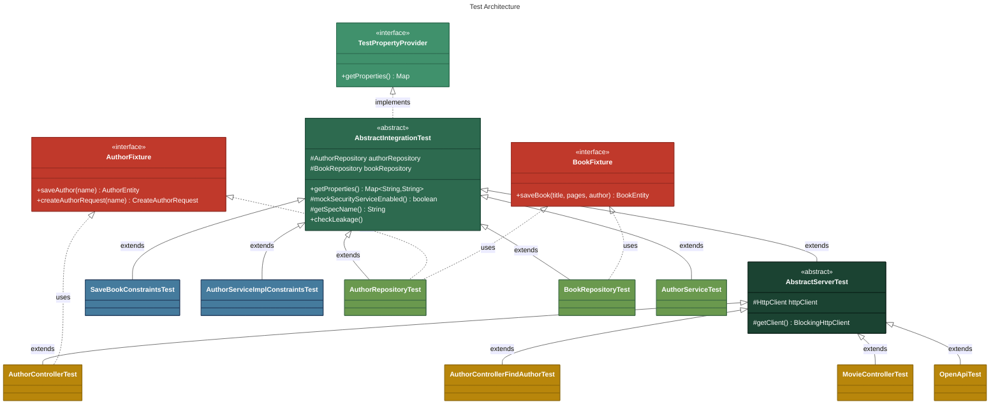
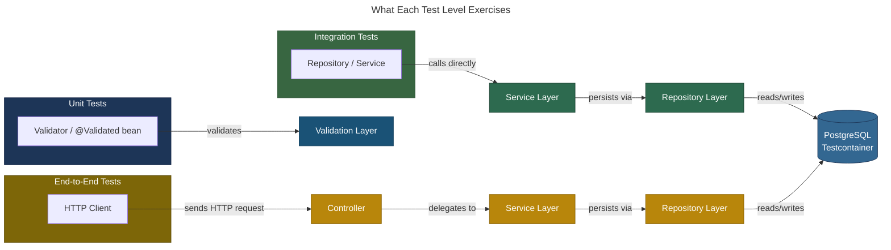

# Micronaut Testing Best Practices with JUnit 5

<p align="center">
  
  
  
  
  
  
  
</p>

This project is a fork
of [ilopmar/micronaut-testing-best-practices](https://github.com/ilopmar/micronaut-testing-best-practices)
by [Iván López](https://github.com/ilopmar), converted to a modern Java stack:

| Original        | This Fork            |
|-----------------|----------------------|
| Java 11         | **Java 25** (LTS)    |
| Micronaut 2.0.0 | **Micronaut 4.10.7** |
| Gradle          | **Maven**            |
| Groovy / Spock  | **Java / JUnit 5**   |

The application logic is identical to the original — only the build tool, test framework, and
runtime versions have been updated. This fork demonstrates that the same testing best practices
(Testcontainers, fixture traits, leakage detection, conditional mock beans) translate cleanly
to Java and JUnit 5.

## Conversion Guide

The migration from Groovy/Spock to Java/JUnit 5 required adapting several patterns and working
around breaking changes across Micronaut versions. Key challenges included:

- **Groovy traits to Java interfaces** with default methods for test fixtures
- **`@MicronautTest(transactional = false)`** to avoid invisible transactions between test and server threads
- **`@ExecuteOn(TaskExecutors.BLOCKING)`** for controllers that make blocking HTTP calls (Micronaut 4 detects event loop
  blocking)
- **`schema-generate: NONE`** on secondary embedded servers to prevent them from dropping shared tables
- **`@Serdeable`** on all DTOs and **`@JsonProperty`** instead of `@JsonNaming` (incompatible with micronaut-serde)
- **`javax.*` to `jakarta.*`** namespace migration, with the non-obvious `javax.annotation.Nullable` to
  `io.micronaut.core.annotation.Nullable`

For the full detailed guide with friendly explanations and deep technical analysis of each
adaptation, see **[docs/CONVERSION_GUIDE.md](docs/CONVERSION_GUIDE.md)**.

## Prerequisites

- **Java 25** (install via [SDKMAN!](https://sdkman.io/) or [mise](https://mise.jdx.dev/))
- **Docker** (for Testcontainers and running PostgreSQL)

## Run the tests

```bash
./mvnw test
```

Tests use [Testcontainers](https://www.testcontainers.org/) to automatically start a PostgreSQL
container, so Docker must be running.

## Test Infrastructure

### Micronaut Test Resources

This project uses **[Micronaut Test Resources](https://micronaut-projects.github.io/micronaut-test/latest/guide/#testResources)**
to manage PostgreSQL Testcontainers automatically during testing. Instead of manually starting and
managing containers, the `micronaut-test-resources` server:

1. Starts a PostgreSQL Testcontainer when tests run
2. Provides dynamically resolved datasource properties (`DATASOURCES_DEFAULT_URL`, `DATASOURCES_DEFAULT_USERNAME`, `DATASOURCES_DEFAULT_PASSWORD`) to the test JVM
3. Ensures all tests share the same database instance for efficiency
4. Stops the container when all tests complete

**Key configuration** (see `pom.xml`):
- `micronaut-test-resources-client`: test dependency that connects to the resource server
- `testResourcesDependencies`: declares the PostgreSQL JDBC provider and docker-java 3.7.0 (required for Docker Engine 29+)
- `testResourcesSystemProperties`: passes `api.version=1.44` to ensure docker-java uses the correct Docker API version
- Surefire `systemPropertyVariables`: configures the server URI so the test JVM can discover the resource server

No manual `@Testcontainers` or `PostgresqlTestContainer` singleton needed—the infrastructure is transparent to tests.

### Java Records as Entities

Entities (`AuthorEntity`, `BookEntity`) are defined as **immutable Java records**, not mutable classes.
Records provide:

- **Type-safe immutability**: Once constructed, all fields are final
- **Compile-time generated accessors**: no `getter` methods—use field names directly: `author.id()`, `author.name()`
- **Clear intent**: the record signature explicitly shows what data the entity holds
- **Less boilerplate**: no need for constructors, equals, hashCode, toString

**Example:**
```java
@MappedEntity(value = "author", schema = "public")
public record AuthorEntity(
    @Id @GeneratedValue(value = Type.IDENTITY) @Nullable Long id,
    @NotBlank String name,
    @DateCreated @Nullable LocalDateTime dateCreated,
    @Relation(value = Relation.Kind.ONE_TO_MANY, mappedBy = "author") @Nullable Set<BookEntity> books) {

    public AuthorEntity(@NotBlank String name) {
        this(null, name, null, Set.of());
    }
}
```

**Key patterns with records:**
- `@Nullable` on generated fields (`id`, `dateCreated`) and relationships—they're populated by the database
- Custom constructors for common creation patterns (e.g., `AuthorEntity(String name)`)
- `repository.save(entity)` returns a new record instance with generated fields populated
- Accessor method names match component names: `author.id()`, not `author.getId()`

## Test Strategy

The project covers three levels of testing. All tests share a real PostgreSQL database via
Testcontainers (managed by Micronaut Test Resources) and a [leakage detector](docs/CONVERSION_GUIDE.md#5-data-leakage-detector)
that fails if any test leaves data behind.





### Unit Tests — bean validation in isolation

These tests exercise validation constraints without starting the HTTP server. They inject the
bean or a `Validator` directly and assert that invalid inputs produce the expected constraint
violations.

| Test                                                                                                           | What it validates                                                                                                                                                                                                                                                                                             |
|----------------------------------------------------------------------------------------------------------------|---------------------------------------------------------------------------------------------------------------------------------------------------------------------------------------------------------------------------------------------------------------------------------------------------------------|
| [`SaveBookConstraintsTest`](src/test/java/com/example/services/SaveBookConstraintsTest.java)                   | Injects `jakarta.validation.Validator` and calls `validator.validate(saveBook)` directly on the DTO. Verifies that blank title, zero pages, and null authorId each produce exactly one `ConstraintViolation` with the correct field path and message.                                                         |
| [`AuthorServiceImplConstraintsTest`](src/test/java/com/example/services/AuthorServiceImplConstraintsTest.java) | Injects `AuthorService` (the real `@Validated` bean) and calls its methods with blank/null arguments. Asserts that `ConstraintViolationException` is thrown with the correct property path (e.g. `saveAuthor.name`). Uses `@ParameterizedTest` + `@MethodSource` to cover multiple invalid inputs per method. |

**How**: extend `AbstractIntegrationTest` (provides DI container + database), inject the bean
under test, call methods directly — no HTTP involved.

### Integration Tests — repository and service layer with a real database

These tests verify that the persistence and business logic layers work correctly against a real
PostgreSQL instance. They call repositories and services directly (not through HTTP).

| Test                                                                                       | What it validates                                                                                                                                                                                                                                        |
|--------------------------------------------------------------------------------------------|----------------------------------------------------------------------------------------------------------------------------------------------------------------------------------------------------------------------------------------------------------|
| [`AuthorRepositoryTest`](src/test/java/com/example/repositories/AuthorRepositoryTest.java) | Saves an `AuthorEntity`, verifies `id` and `dateCreated` are auto-generated. Saves an author with 3 books, then calls `findAuthorByName()` and verifies the `@Join(type = LEFT_FETCH)` query returns the author with all books loaded.                   |
| [`BookRepositoryTest`](src/test/java/com/example/repositories/BookRepositoryTest.java)     | Saves a `BookEntity` associated to an author, verifies `id` and `dateCreated` are auto-generated.                                                                                                                                                        |
| [`AuthorServiceTest`](src/test/java/com/example/services/AuthorServiceTest.java)           | Calls `authorService.saveAuthor()` and verifies the returned DTO has an id and the correct name. Calls `authorService.addBookToAuthor()` then retrieves the author by name and verifies the book was associated via the `@Transactional` service method. |

**How**: extend `AbstractIntegrationTest`, use `implements AuthorFixture, BookFixture` for
factory methods, inject repositories/services, call them directly, assert results.

### End-to-End Tests — full HTTP requests through the embedded server

These tests send real HTTP requests to the Micronaut embedded server, exercising the full stack:
HTTP routing, content negotiation, validation, security, service layer, persistence, and error
handling.

| Test                                                                                                                                  | What it validates                                                                                                                                                                                                               |
|---------------------------------------------------------------------------------------------------------------------------------------|---------------------------------------------------------------------------------------------------------------------------------------------------------------------------------------------------------------------------------|
| [`AuthorControllerTest`](src/test/java/com/example/controllers/AuthorControllerTest.java)                                             | `POST /authors` returns 201 with the created author (id, name, empty books). `POST /authors` with a null name returns 400.                                                                                                      |
| [`AuthorControllerFindAuthorTest`](src/test/java/com/example/controllers/AuthorControllerFindAuthorTest.java)                         | Creates an author in the DB, then `GET /authors/by-name?author=...` returns 200 with the author. Requesting a non-existent author returns 404. Uses the `MockSecurityService` (always allows access).                           |
| [`AuthorControllerFindAuthorWithSecurityTest`](src/test/java/com/example/controllers/AuthorControllerFindAuthorWithSecurityTest.java) | Same endpoint but with the **real** `SecurityServiceImpl`. Without `username=admin`, returns 401. With `username=admin`, returns 200. Demonstrates toggling the mock via `mockSecurityServiceEnabled()`.                        |
| [`AuthorControllerMockServiceTest`](src/test/java/com/example/controllers/AuthorControllerMockServiceTest.java)                       | Replaces `AuthorService` with an inner-class mock that throws `RuntimeException`. `POST /authors` returns 500. Demonstrates per-test bean replacement via `@Primary` + `@Requires(property = "spec.name")`.                     |
| [`MovieControllerTest`](src/test/java/com/example/controllers/MovieControllerTest.java)                                               | Starts a **secondary embedded server** as a mock OMDB API. `GET /movies/by-title?title=...` hits the main server, which calls the mock, and returns the movie. Demonstrates external API mocking without third-party libraries. |
| [`OpenApiTest`](src/test/java/com/example/openapi/OpenApiTest.java)                                                                   | `GET /swagger/demo-0.1.yml` returns 200, verifying the OpenAPI spec is generated and served correctly.                                                                                                                          |
| [`OmdbClientTest`](src/test/java/com/example/omdb/OmdbClientTest.java)                                                                | Calls the **real** OMDB API (skipped by default — see [OMDB API Key](#omdb-api-key) below).                                                                                                                                     |

**How**: extend `AbstractServerTest` (provides `HttpClient` + database), send requests via
`getClient().exchange(HttpRequest.GET/POST(...))`, assert HTTP status codes and response bodies.
Tests use `@MicronautTest(transactional = false)` so that data written by the server is visible
to test assertions (see the
[Conversion Guide](docs/CONVERSION_GUIDE.md#10-micronauttesttransactional--false--o-porque) for why).

## OMDB API Key

The [`OmdbClientTest`](src/test/java/com/example/omdb/OmdbClientTest.java) calls the real
[OMDB API](https://www.omdbapi.com/) and is **skipped by default**. It only runs when the
`OMDB_API_KEY` environment variable is set.

You have two options:

1. **Request your own free API key** at https://www.omdbapi.com/apikey.aspx, then set the
   environment variable:

   ```bash
   # bash / zsh
   export OMDB_API_KEY=your_key_here

   # fish
   set -gx OMDB_API_KEY your_key_here
   ```

   With the variable set, `./mvnw test` will automatically include the OMDB tests.

2. **Use the mock instead** — the [
   `MovieControllerTest`](src/test/java/com/example/controllers/MovieControllerTest.java)
   already tests the movie endpoint using a secondary embedded server as a mock OMDB API,
   without requiring any API key. This is the approach used by all other tests in the project
   and is sufficient for most development workflows.

## Run the application

Start a PostgreSQL database:

```bash
docker run -it --rm -p 5432:5432 \
  -e POSTGRES_USER=micronaut \
  -e POSTGRES_PASSWORD=secret \
  -e POSTGRES_DB=micronaut \
  postgres:16-alpine
```

Start the application (in another terminal):

```bash
./mvnw mn:run
```

Or from the packaged jar:

```bash
./mvnw package -DskipTests
java -jar target/demo-0.1.jar
```

## Endpoints

Create a new author:

```bash
curl -X POST -H 'Content-Type:application/json' -d '{"name":"Stephen King"}' localhost:8080/authors
```

Find an author by name:

```bash
curl -v "localhost:8080/authors/by-name?author=Stephen%20King&username=admin"
```

> The application creates an author with two books automatically when the database is empty.
> See [BootstrapService](src/main/java/com/example/services/BootstrapService.java).

## OpenAPI and Swagger-UI

The application generates an OpenAPI spec at http://localhost:8080/swagger/demo-0.1.yml.

Swagger-UI is available at http://localhost:8080/swagger-ui/index.html.

## Docker

### JVM image (recommended)

Build the image:

```bash
./docker-build.sh
```

Run with a PostgreSQL container on a shared network:

```bash
docker network create demo-net

docker run -d --name postgres --network demo-net \
  -e POSTGRES_USER=micronaut \
  -e POSTGRES_PASSWORD=secret \
  -e POSTGRES_DB=micronaut \
  postgres:16-alpine

docker run --rm --name demo-app --network demo-net -p 8080:8080 \
  -e DATASOURCES_DEFAULT_URL=jdbc:postgresql://postgres:5432/micronaut \
  demo
```

### GraalVM native image

Build the native image with Docker (no local GraalVM required, takes several minutes):

```bash
./docker-build.sh graalvm
```

Run the same way as the JVM image above.

To build a native image locally (requires [GraalVM 25](https://www.graalvm.org/) with
`native-image` installed):

```bash
./mvnw package -Dpackaging=native-image -DskipTests
./target/demo
```

> The local native binary still needs a running PostgreSQL (see [Run the application](#run-the-application)).

## Credits

Original project and testing patterns by [Iván López](https://github.com/ilopmar)
([micronaut-testing-best-practices](https://github.com/ilopmar/micronaut-testing-best-practices)).

## AI-Assisted Development

This entire conversion was performed with the assistance of
[Claude Code](https://docs.anthropic.com/en/docs/claude-code) (Claude Opus 4.6), Anthropic's
CLI agent for software engineering.

**What the AI did:**

- Read and understood all 21 Java source files and 23 Groovy/Spock test files from the original
  project.
- Created the `pom.xml` from scratch, replacing the Gradle build with Maven and selecting the
  correct Micronaut 4.10.7 dependencies with annotation processors.
- Migrated all source files from `javax.*` to `jakarta.*`, added `@Serdeable` annotations,
  and updated deprecated Jackson APIs.
- Designed the Java test architecture: converted Groovy traits to interfaces with default
  methods, Spock specifications to JUnit 5 abstract base classes, and `where:` blocks to
  `@ParameterizedTest` with `@MethodSource`.
- Wrote all 18 JUnit 5 test files, preserving the exact same test coverage and assertions
  as the original Spock tests.
- Diagnosed and fixed runtime issues that only appeared after running the tests:
  `@MicronautTest(transactional = false)` for HTTP test isolation,
  `@ExecuteOn(TaskExecutors.BLOCKING)` for the event loop restriction in Micronaut 4,
  `schema-generate: NONE` on the secondary mock server to prevent table drops,
  and the `@JsonNaming` incompatibility with micronaut-serde.
- Updated Dockerfiles, configuration files, README, and produced the detailed
  [Conversion Guide](docs/CONVERSION_GUIDE.md).

**What the human did:**

- Defined the target stack (Java 25, Micronaut 4, Maven, JUnit 5) and the project goals.
- Reviewed each change, approved tool executions, and guided priorities.
- Confirmed the correct Micronaut version (4.10.7) when the AI initially tried a non-existent
  version.
- Requested the documentation structure and level of detail for the Conversion Guide.

**Post-conversion enhancements (Session 4):**

In a follow-up session, the AI:
- Migrated from manual `PostgresqlTestContainer` to **Micronaut Test Resources**, eliminating boilerplate
  and providing transparent, server-managed Testcontainers integration
- Resolved Docker API version incompatibility (Docker Engine 29+ requires API ≥ 1.44, but docker-java 3.4.1
  uses an older version) by overriding docker-java to 3.7.0 and configuring `testResourcesSystemProperties`
- Converted `AuthorEntity` and `BookEntity` from mutable classes to immutable **Java records**, adapting all
  code to use record accessor methods (`id()`, `name()`) instead of getters, and adding custom constructors
  for flexible entity creation patterns
- Updated all test files and service methods to work with records, capturing the returned value from `repository.save()`
  (since records are immutable and return new instances with generated IDs)

**Takeaway:** The AI handled the mechanical work (reading 44 files, rewriting 39 of them,
diagnosing 6 runtime issues across 4 test runs, plus 10+ additional files in the follow-up session) while
the human provided direction, judgment calls, and domain knowledge. The full conversion including infrastructure
modernization took approximately 4 sessions.
